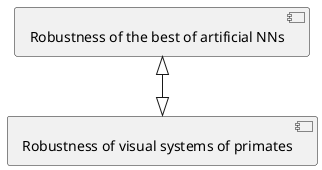

<!-- 
_class: lead gaia
_paginate: false -->
 
## Adversarially trained neural representations may already be as robust as corresponding biological neural representations 
#### Zhiwei Bai
#### Shanghai Jiao Tong University
#### 2022-12-04

---
<!-- backgroundColor: white -->

## About the author?

James J.DiCarlo
- Born in 1968, `neuroscientist `
- Peter de Florez Professor, Brain and Cognitive Sciences
- Director, MIT Quest for Intelligence
- **"Aim to understand how a complex network of brain regions underlies our ability to recognize vast numbers of objects and faces rapidly."**
 

---

## Outline
1. **Motivation**: why do we care about adversarial robustness?
2. **Result**: who is more robust between AT-DNNs and primate visual perception?
3. **Method**: how to measure adversarial sensitivity of IT neural sites?

---
$\quad$
$\quad$
$\quad$
# 1. Motivation: why do we care about adversarial robustness?

---

## Motivation: DNN is VERY brittle
- Pre-trained ResNet50

High confidence (0.996) $\hspace{3.5cm}$ High confidence (0.999)  
 
#### **Some specific perturbations can easily fool current deep neural networks.**

---

## How to create adversarial examples?
- Given data $S = \{(\boldsymbol{x}_j, \boldsymbol{y}_j)\}_{j=1}^{n}$, usual training goal:
$$
\underset{\boldsymbol{\theta}}{\operatorname{min}} R_S(\boldsymbol{\theta}) = \mathbb{E}_S\ell(\boldsymbol{f}_{\boldsymbol{\theta}}(\boldsymbol{x}), \boldsymbol{y}):=\frac{1}{n} \sum_{j=1}^n \ell\left(\boldsymbol{f}_{\boldsymbol{\theta}}(\boldsymbol{x}_j), \boldsymbol{y}_j\right)
$$
- Create adversarial examples: for a fixed $(\boldsymbol{x}, \boldsymbol{y})\in S$,
$$
\underset{\|\boldsymbol{\delta}\| < \epsilon}{\operatorname{max}} \ell\left(\boldsymbol{f}_{\boldsymbol{\theta}}(\boldsymbol{x} + \boldsymbol{\delta}), \boldsymbol{y}\right)
$$
- Targeted attack: $\underset{\|\boldsymbol{\delta}\| < \epsilon}{\operatorname{max}} \left(\ell\left(\boldsymbol{f}_{\boldsymbol{\theta}}(\boldsymbol{x} + \boldsymbol{\delta}), \boldsymbol{y}\right) -\ell\left(\boldsymbol{f}_{\boldsymbol{\theta}}(\boldsymbol{x} + \boldsymbol{\delta}), \boldsymbol{y}_{\mathrm{target}}\right)\right)$

---

## What is adversarial training?
- Usual training goal:
$$
\underset{\boldsymbol{\theta}}{\operatorname{min}} R_S(\boldsymbol{\theta}) = \mathbb{E}_S\ell(\boldsymbol{f}_{\boldsymbol{\theta}}(\boldsymbol{x}), \boldsymbol{y}):=\frac{1}{n} \sum_{j=1}^n \ell\left(\boldsymbol{f}_{\boldsymbol{\theta}}(\boldsymbol{x}_j), \boldsymbol{y}_j\right)
$$
- Adversarial training goal:
$$
\underset{\boldsymbol{\theta}}{\operatorname{min}} \hat{R}_S(\boldsymbol{\theta}) = \mathbb{E}_S\max_{\|\boldsymbol{\delta}\|<\epsilon}\ell(\boldsymbol{f}_{\boldsymbol{\theta}}(\boldsymbol{x}+\boldsymbol{\delta}), \boldsymbol{y}):=\frac{1}{n} \sum_{j=1}^n \max_{\|\boldsymbol{\delta}_j\|<\epsilon}\ell\left(\boldsymbol{f}_{\boldsymbol{\theta}}(\boldsymbol{x}_j + \boldsymbol{\delta}_j), \boldsymbol{y}_j\right)
$$
- $R_S(\boldsymbol{\theta}) \leq \hat{R}_S(\boldsymbol{\theta})$, intuitively $\hat{R}_S(\boldsymbol{\theta})$ is the `worst-case`.

---

## Is adversarial training enough?
- Gold standard of robust perception: visual systems of primates

$\hspace{1.8cm}$

<!-- 

 -->

---

## Do visual systems of primates really robust?
 

---

## Do visual systems of primates really robust?
 

---

## Are these adversarial examples in primates widespread or only for a few specific tasks?
In particular, do adversarial examples exist for cat and dog classification tasks?
#### To answer the question, we need answer:
1. How to set $\epsilon$ in $\|\boldsymbol{\delta}\| < \epsilon$ ?
2. "Worst-case" relies on detailed knowledge. How to create adversarial examples?
$$\underset{\|\boldsymbol{\delta}\| < \epsilon}{\operatorname{max}} \ell\left(\boldsymbol{r}(\boldsymbol{x} + \boldsymbol{\delta}), \boldsymbol{y}\right)$$
<!--  -->

---

## How to set $\epsilon$ in $\|\boldsymbol{\delta}\| < \epsilon$ ?
- Consider $l_2$ norm $\|\delta\|_2 < \epsilon$

- Restrict to a specific regime, such as $[1, 10]$

---

## "Worst-case" relies on detailed knowledge. How to create adversarial examples?
$$\ell(\boldsymbol{\delta}^*):=\underset{\|\boldsymbol{\delta}\| < \epsilon}{\operatorname{max}} \ell\left(\boldsymbol{r}(\boldsymbol{x} + \boldsymbol{\delta}), \boldsymbol{y}\right)$$
1. Black-box attack: without using detailed knowledge.
   - Rely on `random sampling` image perturbation directions, "unlikely to yield good estimates of adversarial sensitivity".

2. Build a  “white-box” model to `estimate` the adversarial example.
   - This paper develops an experimental method to do this.
   - `Lower bound` is enough for this paper's claim.

---

## Which area of neurons to choose?
- V1 (Primary Visual cortex)
  - Support: Primates is more robust
- IT (Inferior Temporal cortex)
  - Support: Artificial NN is more robust
  - Compare with the penultimate layer of DNN

---

## How to quantify robustness?
- Create adversarial examples: for a fixed $(\boldsymbol{x}, \boldsymbol{y})\in S$,
$$\ell(\boldsymbol{\delta}^*):=\underset{\|\boldsymbol{\delta}\| < \epsilon}{\operatorname{max}} \ell\left(\boldsymbol{r}(\boldsymbol{x} + \boldsymbol{\delta}), \boldsymbol{y}\right)$$
- Quantify sensitivity: for a fixed $\boldsymbol{x}\in S_{\boldsymbol{x}}$ and a fixed $i^{\mathrm{th}}$ neural site,
$$
s_i(\boldsymbol{x}, \epsilon) := \underset{\|\boldsymbol{\delta}\|_2 < \epsilon}{\operatorname{max}}| r_i(\boldsymbol{x} + \boldsymbol{\delta}) - r_i(\boldsymbol{x})|
$$
### $\hspace{1.5cm}$ **Why not $\underset{\|\boldsymbol{\delta}\|_2 < \epsilon}{\operatorname{max}}\| \boldsymbol{r}(\boldsymbol{x} + \boldsymbol{\delta}) - \boldsymbol{r}(\boldsymbol{x})\|_1$ ?**

---

## Quantify robustness: individual unit level
- Quantify sensitivity: for a fixed $\boldsymbol{x}\in S_{\boldsymbol{x}}$ and a fixed $i^{\mathrm{th}}$ neural site,
$$
s_i(\boldsymbol{x}, \epsilon) := \underset{\|\boldsymbol{\delta}\|_2 < \epsilon}{\operatorname{max}}| r_i(\boldsymbol{x} + \boldsymbol{\delta}) - r_i(\boldsymbol{x})|
$$
- Marginalizing the image distribution $S_{\boldsymbol{x}}$:
$$
s_i(\epsilon) := \mathbb{E}_{\boldsymbol{x}\sim S_{\boldsymbol{x}}}[s_i(\boldsymbol{x}, \epsilon)]
$$
- Normalized adversarial sensitivity:
$$
\tilde{s}_i(\epsilon) = \dfrac{s_i(\epsilon)}{\sigma_i}, \text{where } \sigma_i = \left(\mathrm{Var}_{\boldsymbol{x}\sim S_{\boldsymbol{x}}}r_i(\boldsymbol{x})\right)^{\frac{1}{2}} 
$$

---

$\quad$
$\quad$
$\quad$
# 2. Result: who is more robust between AT-DNNs and primate visual perception?

---

### Who is more robust?
- The number of IT sites $m=21$
$
\tilde{s}(\epsilon) = \dfrac{1}{m}\sum\limits_{i=1}^{m}\tilde{s}_i(\epsilon)$
- Adversarially trained NN $(l_2\epsilon=3)$, 10-fold smaller
- Grey dashed: standard deviation
- Blue dashed: random pairs of images $\dfrac{1}{C_n^2}\sum\limits_{j\neq k}|r_i(\boldsymbol{x}_j)- r_i(\boldsymbol{x}_k)|/\sigma_i$

---

##### What do the adversarial examples of primate IT neurons look like?
$\hspace{1.4cm}$

---

#### How stable is “category preference”  of each IT neural site?
- Fix a site, identify the most and least preferred categories
- #### **Q: Is "category preference" well-defined?**
- Perform targeted adversarial perturbation
- $\epsilon =2.5$ highly-preferred
- $\epsilon =10$ "super-stimuli"
- Red dashed: preferred images
 

---

#### Are all IT neurons susceptible, or could the average results be due to just a few strongly modulated neurons?
- Adversarial images can be found on `all recorded IT sites `
- Adversarial images can be found very close to `any clean images`
$\hspace{2cm}$
- Adversarial samples for biological neurons are `dense` in the image space similar to that of artificial neural networks

---

$\quad$
$\quad$
$\quad$

# 3. Method: how to measure adversarial sensitivity of IT neural sites?

---

## Measure adversarial sensitivity of IT neural sites
- Recall goal:
$$
s_i(\boldsymbol{x}, \epsilon) := \underset{\|\boldsymbol{\delta}\|_2 < \epsilon}{\operatorname{max}}| r_i(\boldsymbol{x} + \boldsymbol{\delta}) - r_i(\boldsymbol{x})|
$$
- Method: Build a  “white-box” model to `estimate` the adversarial example
  - Iteratively generate better lower bound of adversarial example 

<!-- ## Screen a baseline model, criteria:
1. Global representational similarity to IT as measured by CKA
2. Cross-validated linear predictivity for IT responses
3. How well does perturbations targeted toward a model layer transfers to IT neurons without any explicit mapping between the two systems -->

---

### Screen a baseline model, criteria
1. Global representational similarity to IT as measured by CKA
2. Cross-validated linear predictivity for IT responses
3. How well does perturbations targeted toward a model layer transfers to IT neurons without any explicit mapping between the two systems
$\hspace{2cm}$

---

## ResNet50
$\quad$
$\quad$
$$
\begin{aligned}
    &1 \text{ (conv)}\\
    +& 3\times 4  \text{ (conv\_block)}\\
    +& 3\times (2+3+5+2) \text{ (identify\_block)}\\
    + & 1\text{ (Fully-connected)}\\
    = & 50 
\end{aligned}
$$
$\hspace{2.5cm}$

---

## Create adversarial examples iteratively

---

#### Details of measure effect of attacks on IT neural sites
- Show both clean and attack images to a `fixating monkey`
- The visual stimuli are presented `8 degrees `over the visual field for 100ms followed by a 100ms `grey mask` as in a standard rapid serial visual presentation (RSVP) task.
- The average temporal separation between a clean image and its perturbed pair is `25 minutes`
- Total of `6 days`. 
- For Figure 1A, we report IT sensitivity from the last day of experiment which sampled `882 unique images` per perturbation $\epsilon$ (i.e. 42 images per neural site).
- Measure the total number spikes between `70ms-170ms` after image presentation. 

---

## Does the method work?
1. Neural perturbation magnitude has an `consistent improvement` over days.
2. The perturbations achieved with our method is `significantly larger` than that achieved with a model-free method.
3. This explains why the field has systematically `underestimated` the sensitivity.
 

<!-- ---

## Some specific details: bias
- In the presence of measurement noise, taking the average of the absolute value of response change will result in a `positive bias`.
- For $x_j$ where $j=0,1, \ldots, n$, out of $n$ number of images: 
$$
\begin{aligned}
    E_j\left[\left|r_i\left(x_j\right)-r_i\left(x_j+\delta_{i, j}\right)\right|\right]& =\frac{1}{n} \sum_j \operatorname{sign}\left(r_i\left(x_j\right)-r_i\left(x_j+\right.\right.\left.\left.\delta_{i, j}\right)\right)\left(r_i\left(x_j\right)-r_i\left(x_j+\delta_{i, j}\right)\right.\\
    & \geq \frac{1}{n}\sum_j \text{sign}(f_i(x_j, \theta)-f_i(x_j+\delta_{i,j},\theta))(r_i(x_j)-r_i(x_j+\delta_{i,j})
\end{aligned}
$$
- This estimator becomes `unbiased` if the model of IT site $f_i(x, \theta)$ from the previous day predicted all the directions of neural movement correctly. -->

---

### Introduce multiple methods to drastically improve convergence beyond the basic PGD
1. $100$ `independent runs` for solving the adversarial images
2. Optimizing $\underset{\|\boldsymbol{\delta}\|_2 < \epsilon}{\operatorname{max}} f_i(\boldsymbol{x} + \boldsymbol{\delta}) - f_i(\boldsymbol{x})$ and $\underset{\|\boldsymbol{\delta}\|_2 < \epsilon}{\operatorname{max}} f_i(\boldsymbol{x}) - f_i(\boldsymbol{x} + \boldsymbol{\delta})$ `separately` — reduce the chances to be stuck at saddle point. **Why?**
3. `Larger` $\epsilon$ converges faster. First with a ball of radius $2\epsilon$ and finally with one of radius $\epsilon$. **Why?**
4. `Simulated annealing` with restarts: we begin with steps of size $\epsilon$ and reduce them by 10% every time no progress is made.

---

## PGD
- Goal:
    $$
    s_i(\boldsymbol{x}, \epsilon) := \underset{\|\boldsymbol{\delta}\|_2 < \epsilon}{\operatorname{max}}| f_i(\boldsymbol{x} + \boldsymbol{\delta}) - f_i(\boldsymbol{x})|
    $$
- Projected Gradient Descent
$$ 
\underset{\|\boldsymbol{\delta}\|_2 < \epsilon}{\operatorname{min}} g(\boldsymbol{\delta}):= -| f_i(\boldsymbol{x} + \boldsymbol{\delta}) - f_i(\boldsymbol{x})|
$$
$$
\begin{gathered}
\tilde{\boldsymbol{\delta}}_{t+1}=\boldsymbol{\delta}_t-\eta \nabla g\left(\boldsymbol{\delta}_t\right) \\
\boldsymbol{\delta}_{t+1}=\underset{{\|\boldsymbol{\delta}\|_2 < \epsilon}}{\mathrm{argmin}}\left\|\tilde{\boldsymbol{\delta}}_{t+1}-\boldsymbol{\delta}\right\|_2
\end{gathered}
$$
 

---

## Conclusion
The representations learned by adversarially trained artificial neural networks have already `exceeded` that of the corresponding biological neural representation in terms of their `individual unit level` adversarial robustness.

---

### **Paradox**: how is it that primate visual perception seems so robust yet its fundamental units of computation are far more sensitive than expected?
1. Visual object recognition behavior in primate is actually `NOT adversarial robust`
2. There is an unknown `error-correction `mechanism at the `population level` in IT or in a down-stream area that decodes object identity
  
---

## Future work & new start
- Population level robustness
- Provides us with a set of standardized procedure

---
$\quad$
$\quad$
# <!-- fit -->Thank you!